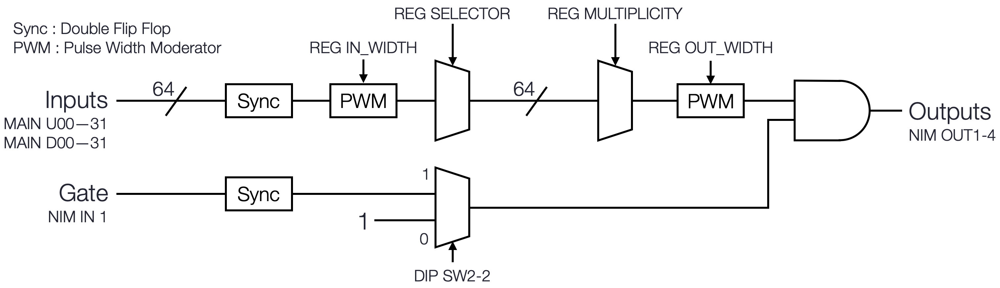

# HUL multiplicity logic

<div style="text-align: right;">
March 18, 2021<br>
Shuhei Hayakawa
</div>

## Overview

This is a logic signal generator that outputs when the number of input signals is greater than or equal to a set number of signals.
The specification is shown in the following table.

| | Description |
| :------------- | :------------- |
| Firmware | magic: 0x4d70, version 0x0100 |
| Operating clock frequency | 200 MHz |
| Signal input  | 64 channels, LVDS/ECL/PECL/LVPECL |
| Signal input width (common) | 0-635 ns in 5 ns steps (7 bits) |
| Minimum signal input width | >5 ns |
| Gate input | 1 channel, NIM |
| Output | 4 channels, NIM |
| Output width (common) | 0-635 ns in 5 ns steps (7 bits) |
| Multiplicity | 0-64 for each output |
| LVDS copy output | 64 channels |

## Firmware

The hardware pin assignments are as shown in the following table.  
The input signals are 64 channels of Main Port U and D.
It is not necessary to use Mezzanine U and D, but LVDS copy outputs are available
if DTL mezzanine board is installed.
NIM IN1 is for the gate input. NIM OUTs are outputs.
DIP SW1 is not used.
When DIP SW2 \#1 is on, HUL is configured in SiTCP force default mode.
When DIP SW2 \#2 is on, the gate is enabled; when it is off, the gate is always 1.
LED \#1 lights when the gate is 1.

| | Description |
| ------------- | ------------- |
| Main Port U | 32 inputs, 01-32 ch |
| Main Port D | 32 inputs, 33-64 ch |
| Mezzanine U | 32 outputs, copy of Main Port U |
| Mezzanine D | 32 outputs, copy of Main Port D |
| NIM IN | 1: GATE, Others: No connection |
| NIM OUT | 4 outputs, multiplicity configurable |
| DIP SW1 | No connection |
| DIP SW2 | 1: SiTCP force default, 2: Gate enable, Others: No connection |
| LED | 1: Light when Gate is 1, Others: No connection |

The overall diagram of the circuit is shown in the following figure.
After passing through Selector, the signal is divided into four and goes to the multiplicity logic circuit.
There are four multiplicity logic circuits and the subsequent ones.
The figure shows one flow.



The following is a list of registers of "Multiplicity Logic" module.
The module ID is 0x1.  
For each selector register, the smaller number of the channel is the LSB and the larger number is the MSB. The default values of the selector registers at power-on are all 1.
The default value for the width register is 10 for both inputs and outputs.
The default values for the multiplicity register are 2, 3, 4, and 5.

<div class="page-break"></div>

| Register      | Address     | Type | Width | Description |
| :------------- | :------------- | :- | :- | :- |
| SELECTOR_01_08 | 0x000 | R/W | 8 | Selector for channels 1 to 8 (default=0xff) |
| SELECTOR_09_16 | 0x010 | R/W | 8 | Selector for channels 9 to 16 (default=0xff) |
| SELECTOR_17_24 | 0x020 | R/W | 8 | Selector for channels 17 to 24 (default=0xff) |
| SELECTOR_25_32 | 0x030 | R/W | 8 | Selector for channels 25 to 32 (default=0xff) |
| SELECTOR_33_40 | 0x040 | R/W | 8 | Selector for channels 33 to 40 (default=0xff) |
| SELECTOR_41_48 | 0x050 | R/W | 8 | Selector for channels 41 to 48 (default=0xff) |
| SELECTOR_49_56 | 0x060 | R/W | 8 | Selector for channels 49 to 56 (default=0xff) |
| SELECTOR_57_64 | 0x070 | R/W | 8 | Selector for channels 57 to 64 (default=0xff) |
| IN_WIDTH       | 0x080 | R/W | 7 | Common input width, LSB: 5 ns (default=0x0a) |
| OUT_WIDTH      | 0x090 | R/W | 7 | Common output width, LSB: 5 ns (default=0x0a) |
| MULTIPLICITY_1 | 0x110 | R/W | 7 | Multiplicity for output 1 (default=0x02) |
| MULTIPLICITY_2 | 0x120 | R/W | 7 | Multiplicity for output 2 (default=0x03) |
| MULTIPLICITY_3 | 0x130 | R/W | 7 | Multiplicity for output 3 (default=0x04) |
| MULTIPLICITY_4 | 0x140 | R/W | 7 | Multiplicity for output 4 (default=0x05) |

The following is a list of registers of "Bus Controller" module.
The module ID is 0xe.
These registers are the same as in other HUL firmware.

| Register | Address     | Type | Data width | Description |
| :------- | :--------- | :- | :- | :- |
| Reset    | 0x000 | -/W | - | Reset all except for SiTCP. |
| Version  | 0x010 | R/- | 32 | Read firmware magic and version. |
| Reconfig | 0x000 | -/W | - | Reconfig FPGA. |

## Slow control

The register control software can be downloaded from the git repository.

```
$ git clone ssh://sks@www-online.kek.jp:8022/~/public_html/git/hul_trigger.git
$ cd hul_trigger
$ git checkout -b multiplicity-v1.0 refs/tags/multiplicity-v1.0
$ cd multiplicity-logic/slow-control
$ make
```

Execute command
```
Set registers : ./bin/Register param/foo.txt
Print version : ./bin/Debug
Reconfig FPGA : ./bin/ReconfigFPGA
```

The format of the parameter file is as follows.
The selector is set for each channel and internally converted to an 8-bit set.

```
#
# SELECTOR  0:off  1:on
#
SELECTOR_1                      1
SELECTOR_2                      1
SELECTOR_3                      1
...
SELECTOR_64                     1
#
# WIDTH  0-127, 1 clock is 5 ns (200 MHz)
#
IN_WIDTH                10
OUT_WIDTH               10
#
# MULTIPLICITY  0-64, 0 disables output
#
MULTIPLICITY_1          2
MULTIPLICITY_2          3
MULTIPLICITY_3          4
MULTIPLICITY_4          5
```
